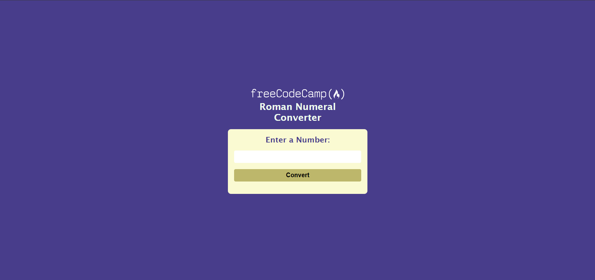

# Roman Numerals Converter

This application allows users to convert numbers to roman numerals, if they fall between 1-3999.
it employs a simple input validation to ensure the user enters the correct input.

## Table of contents

-   [Overview](#overview)
    -   [The challenge](#the-challenge)
    -   [Screenshot](#screenshot)
    -   [Links](#links)
-   [Author](#author)

## Overview

### The challenge

Users are able to:

-   Enter a number between 1-3999 and see the corresponding roman numeral in the results tab.

### Screenshot

### Links

-   Solution URL: [Github repo](https://github.com/S4V10N/roman-numrals-converter.git)
-   Live Site URL: [Live preview](https://roman-numrals-converter.vercel.app/)

## Author

-   Website [Didia praise](https://savion-dev.vercel.app)

-   Twitter [Dev Savion](https://x.com/dev_savion?s=21)
